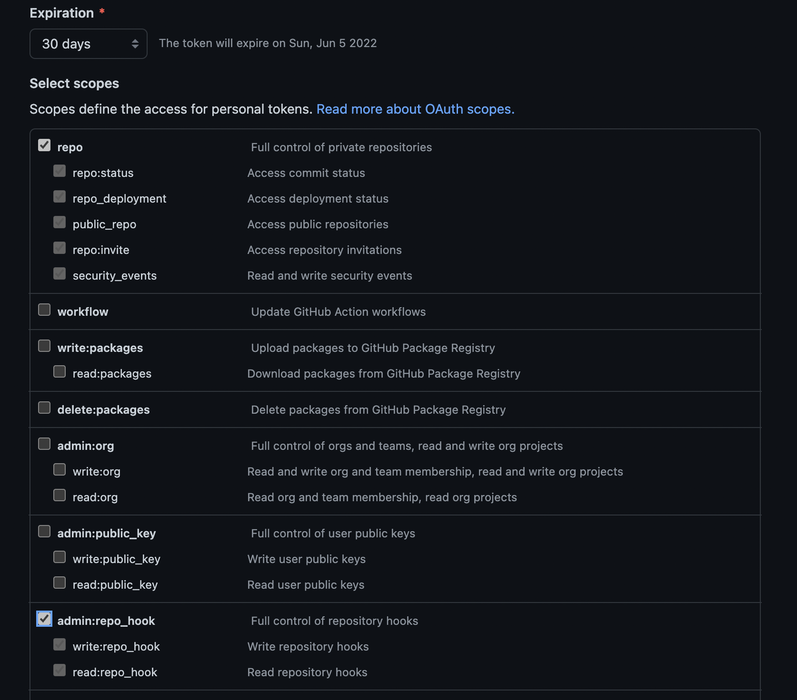
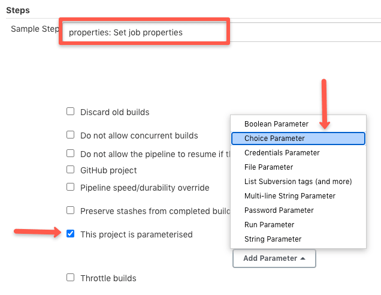

# jenkins


1. github에 수정 된 소스코드 push
2. github는 push 이벤트가 발생하면 Jenkins로 webhook을 전송
3. Jenkins는 webhook을 받으면, 'publish over SSH' 플러그인을 이용해 원격 서버에서 shell 명령을 수행
   (Jenkins 서버에서 원격 서버에 ssh 접속이 가능해야함)
   Jenkins에서 설정할 수 있으며, ssh를 이용한 통신이 잘되는지 테스트 또한 자체적으로 가능
4. Jenkins가 원격 서버에 쉘 명령을 통해 github의 소스 코드를 clone
5. clone 해온 소스코드로 새롭게 Docker 이미지를 빌드하고, 컨테이너를 실행한다.
   예제 서버는 nodejs이다.

Setup

- 1. jenkins 설치
- 2. github token 발급 및 젠킨스에 등록하기
- 3. pipeline 작성하기

## jenkins 설치

docker 설치 후 docker-compose로 빌드

```sh
curl -fsSL https://get.docker.com -o get-docker.sh
sh get-docker.sh
```

```sh
docker-compose up -d
```

1. 젠킨스 초기 비밀번호 확인 및 입력

```
cat /var/jenkins_home/secrets/initialAdminPassword
```


2. 플러그인 자동 설치


3. 접속 완료


### 플러그인 설치하기

플러그인이 설치가 안될 경우 수동 설치

### 타임 존 서울로 설정하기

Jenkins 관리 -> Script console에서 다음 스크립트 입력

```
System.setProperty('org.apache.commons.jelly.tags.fmt.timeZone', 'Asia/Seoul')
```

## github token 발급 및 젠킨스에 등록하기

1. github Settings > Developer settings (LINK: https://github.com/settings/tokens)


2. repo와 admin:repo_hook을 선택해서 해당 권한 부여



3. 토큰 Copy


4. github 토큰 등록하기


username: github id
id: github id
password : github 토큰


## pipeline 작성하기

### 브랜치마다 다른 env 파일 load하기

1. $JENKINS_HOME/envvars/\*

젠킨스 홈 디렉토리에 관련 env 파일을 작성한다.

젠킨스 홈 디렉토리는 `/var/jenkins_home` 일 것이다.

```groovy
env.DB_URL="hello"
env.DB_URL2="hello2"
```

```
node {
    load "$JENKINS_HOME/envvars/my-env.groovy"
    echo "${env.DB_URL}"
    echo "${env.DB_URL2}"
}
```

### 젠킨스에서 원격 서버 ssh 접속하기

1. 젠킨스 서버에서 ssh 키페어 생성

```sh
cd ~/.ssh
ssh-keygen -t rsa
```

2. 원격 서버에 ssh 공개키 등록

만약 계정 이름이 'ubuntu'라면 /home/ubuntu/.ssh/ 디렉토리에 있는 'authorized_keys'파일에 위에서 생성한 public key를 등록

```sh
cd ~/.ssh
cat authorized_keys
ssh-rsa AXXXXXD(생략) jenkins서버계정명@jenkins서버호스트네임
```

3. 젠킨스 서버에서 원격 서버로 ssh 접속 확인

```sh
ssh ubuntu@remote-server
```

### 원격 서버 파일 ftp 전송 및 명령어 실행하기 (public over ssh)

```pipeline
pipeline {
    agent any
    tools {nodejs "nodejs"}

    stages {
        stage('build') {
            steps {
                load "$JENKINS_HOME/env/admin-front.env"
                sh 'echo $REACT_APP_BASE_URL'
                sh 'npm install'
                sh 'CI=false npm run build'
            }
        }

        stage('Deploy') {
            steps {
                script {
                    sshPublisher(
                        failOnError: true,
                        publishers: [
                            sshPublisherDesc(
                                configName: 'ubuntu',
                                verbose: true,
                                transfers: [
                                    // 젠킨스에서 원격 서버로 파일 전송
                                    sshTransfer(
                                        cleanRemote:false,
                                        sourceFiles: 'build/**/*',
                                        remoteDirectory: './build',
                                    ),
                                    // 젠킨스에서 원격 서버에 명령어 실행
                                    sshTransfer(
                                        execCommand: 'echo "hello jenkins" > test.txt '
                                    )
                                ]
                            )
                        ]
                    )
                }
            }
        }
    }
}
```

## jenkins 계정 권한 설정

1. `Matrix Authorization Strategy` 플러그인 설치

2. Jenkins 관리 > Configure Global Security > Authentication > Authorization 에서 Matrix-based security

3. 다음처럼 설정


## jenkins 웹훅

1. 플러그인설치
   

2. webhook-활성화
   

3. 토큰 값 추가
   

4. 특정 브랜치필터
   

## jenkins 빌드파라미터 추가 및 읽기




`params.필드명`으로 접근

```
stage('Deploy to Production') {
    steps {
            sh """
            echo $params.ENVIRONMENT
            """
    }
}
```

## Reference

https://www.jenkins.io/doc/pipeline/steps/publish-over-ssh/

https://stackoverflow.com/questions/39171341/load-file-with-environment-variables-jenkins-pipeline

https://ws-pace.tistory.com/136

https://not-to-be-reset.tistory.com/428

https://devopscube.com/declarative-pipeline-parameters/
